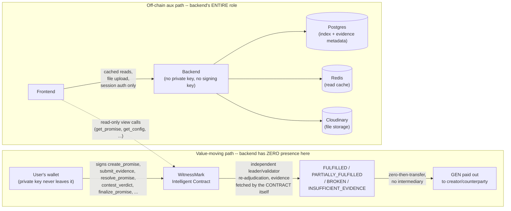

# WitnessMark — System Architecture

## Flow

```
User (wallet)
   |
   v
Frontend (Next.js, Vercel) --- wallet-signed writes ---> GenLayer StudioNet
   |                                                        (WitnessMark Intelligent Contract)
   | cached reads / auth / uploads
   v
Backend (Node/Express, Fly.io, 24/7) ---read-only--------> GenLayer StudioNet (via genlayer-js)
   |              |
   v              v
Fly Postgres   Upstash Redis (cache, 30 req/min GenLayer limit)
   |
   v
Cloudinary (evidence file storage -> stable public URL)
```

## What the backend can and cannot do

This diagram exists specifically to make one fact checkable at a glance:
the backend has no path to influence a verdict or move GEN. It sits
beside the write path, never on it.



The backend cannot: sign a transaction, hold GEN, call any state-changing
contract method, override a verdict, or serve a substitute/mocked
verdict to the frontend. A fully compromised backend can leak evidence
metadata or serve stale cached reads — it cannot move a single wei. See
`docs/security.md` for the full threat model.

## Source of truth

| Data | Source of truth |
|---|---|
| Promise financial state (stake, status, verdict, payouts) | **Blockchain** (WitnessMark contract) |
| Promise terms (statement/conditions/evidence requirements) | **Blockchain** (immutable once created) |
| "My promises" list index | **Backend DB**, advisory/derived — rebuildable from `get_party_promise_ids` |
| Evidence file metadata (who uploaded, when, Cloudinary URL) | **Backend DB** |
| Wallet auth sessions | **Backend** (JWT, httpOnly cookie) |
| UI cache | **Frontend only** |

The backend never re-implements financial logic. It is a read-cache and
off-chain-metadata layer in front of a chain that is always authoritative.

## Why a backend exists at all (vs. pure frontend-to-chain)

1. GenLayer StudioNet enforces a 30 requests/minute read limit. A backend
   cache (Redis, short TTLs) absorbs repeated dashboard/list reads so many
   concurrent users don't each hit the RPC directly.
2. Evidence file uploads need a place to land before they have a URL the
   contract can fetch — that's Cloudinary, proxied through the backend so
   API credentials never reach the client.
3. Wallet-signature verification for session auth needs a server-held
   nonce store and JWT secret.

## Components

- **contracts/witnessmark_contract.py** — the `WitnessMark` Intelligent
  Contract. This is the ONLY GenLayer Intelligent Contract in the
  system — no helper contracts, token contracts, factories, registries,
  or proxies. Every value-moving decision (was the promise fulfilled,
  broken, or partially fulfilled; how much of the stake goes to which
  party) is made by this one contract's own validator consensus, never
  by the backend or frontend. Deployed by the user to StudioNet (never by
  Claude). See `docs/contract.md` for the full design and
  `docs/deployment-manifest.md` / `MEMORY.md` for the current deployed
  address and its verification status.
- **backend/** — Node 20 / TypeScript / Express. Deployed to Fly.io as
  `witnessmark-api`, 24/7 (`min_machines_running=1`, `auto_stop_machines=
  false`, always-restart policy). Talks to Fly Postgres (`witnessmark-db`)
  and Upstash Redis. Read-only against the chain.
- **frontend/** — Next.js (App Router), deployed to Vercel. Wallet connect
  via Reown AppKit; all contract writes are signed client-side via
  genlayer-js using the connected wallet, never proxied through the
  backend.
